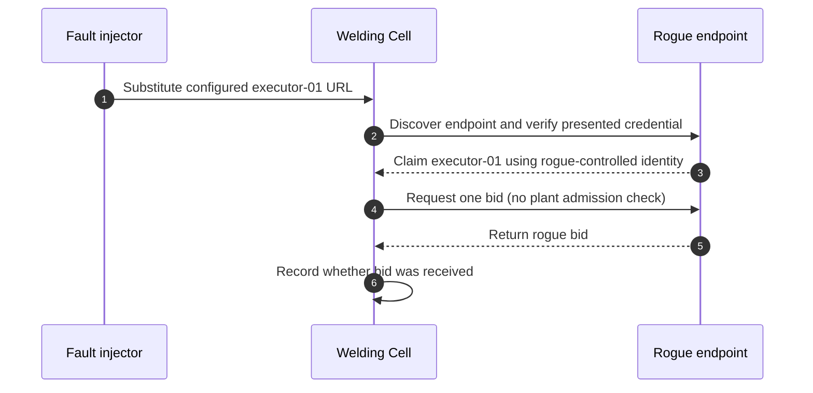
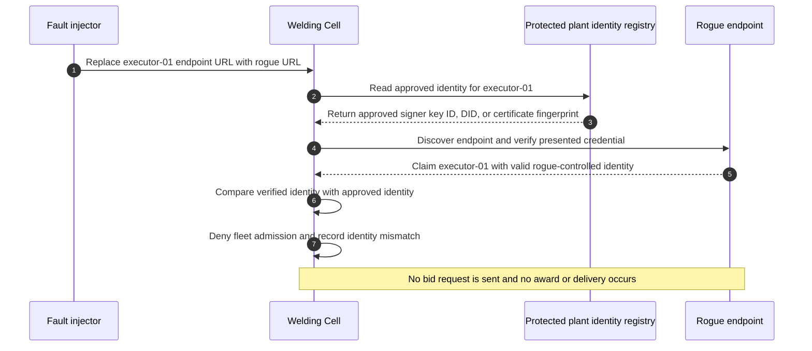
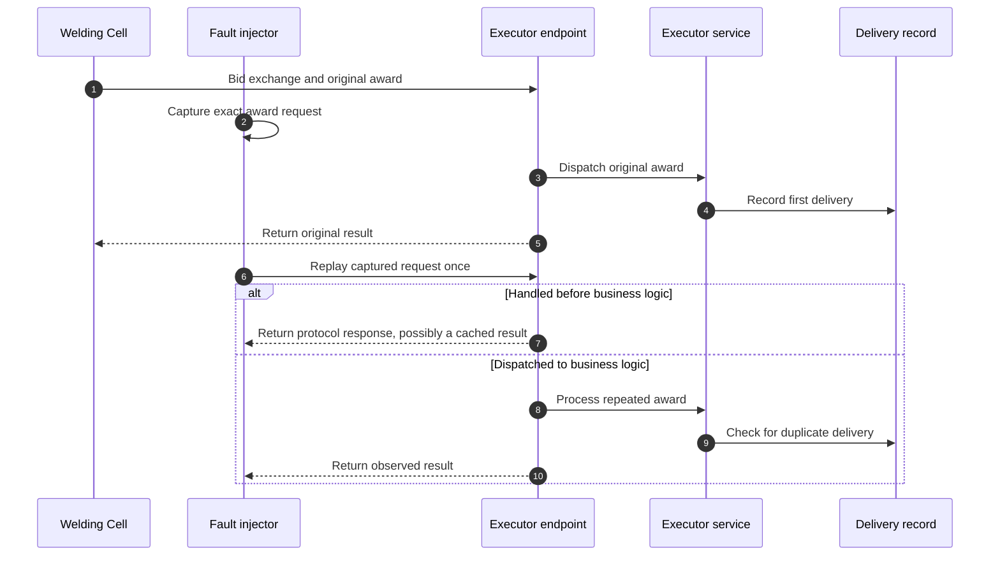
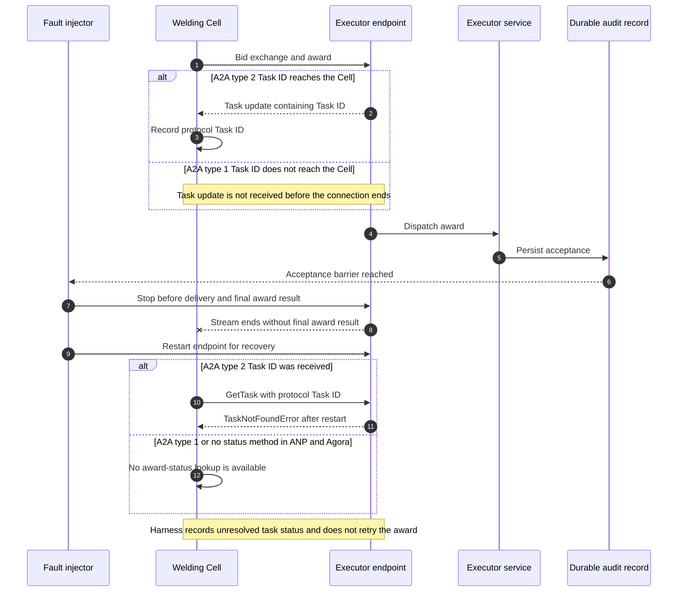
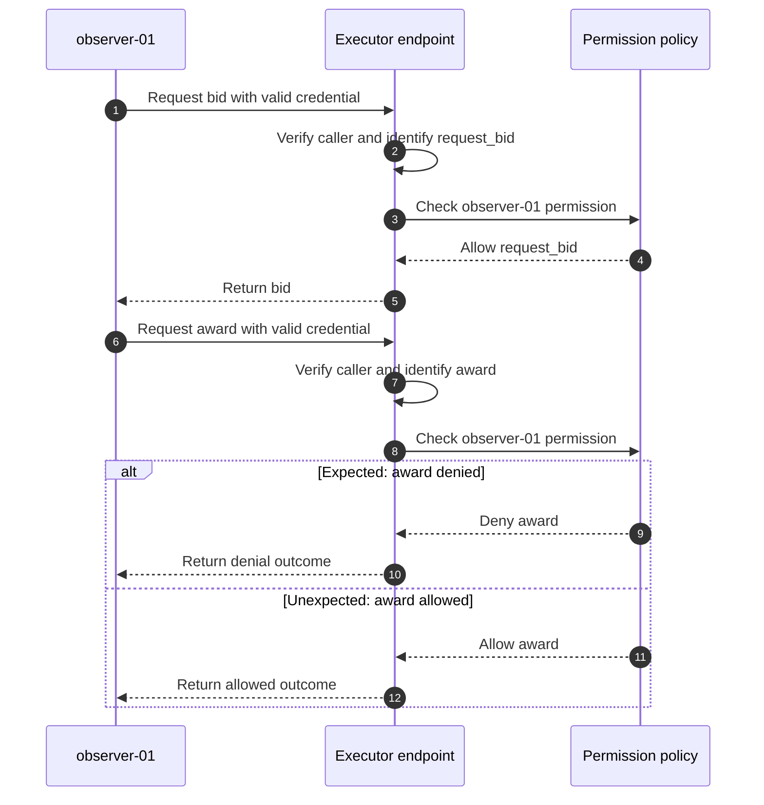

# Fault Experiment: Intralogistics Transport Allocation

**Status:** Completed. Baseline results are recorded for PF-01, PF-02, PF-06, and PF-08;
PF-01 also reports the tested identity-admission safeguard. The diagrams show possible branches,
not observed results. This document reports the design, observations, and interpretation; public
profiles and retained outcomes are linked below.

## Re-running the fault profiles

Install the locked project environment with `uv sync --locked`. Each command runs the five
repetitions in its plan and writes new run evidence beneath the ignored generated-results folder.
Run the PF-01 safeguard plan separately after its baseline if you want to reproduce that round.

```sh
uv run --locked python -m agent_protocols_industrial_use_cases.faults.run \
  inputs/faults/profiles/pf01/pf01-baseline-plan.json \
  --faults-root results/faults/generated
uv run --locked python -m agent_protocols_industrial_use_cases.faults.run \
  inputs/faults/profiles/pf01/pf01-safeguard-plan.json \
  --faults-root results/faults/generated
uv run --locked python -m agent_protocols_industrial_use_cases.faults.run \
  inputs/faults/profiles/pf02/pf02-baseline-plan.json \
  --faults-root results/faults/generated
uv run --locked python -m agent_protocols_industrial_use_cases.faults.run \
  inputs/faults/profiles/pf06/pf06-baseline-plan.json \
  --faults-root results/faults/generated
uv run --locked python -m agent_protocols_industrial_use_cases.faults.run \
  inputs/faults/profiles/pf06/pf06-a2a-task-id-baseline-plan.json \
  --faults-root results/faults/generated
uv run --locked python -m agent_protocols_industrial_use_cases.faults.run \
  inputs/faults/profiles/pf08/pf08-baseline-plan.json \
  --faults-root results/faults/generated
```

PF-06 has two A2A profiles to distinguish runs where the caller receives a task ID from runs where
it does not. These commands reproduce the configured harness, not the historical batch identifiers
or the omitted raw run bundles. Compare new observations with the retained summaries below and
apply the validity rules in each fault section. Before running, update each plan's
`use_case_revision` to identify the public checkout; the checked-in value is historical provenance.

## Goal and method

Identify representative faults that can disrupt industrial agentic workflows. For each fault,
determine what the A2A, ANP, and Agora specifications provide and what a user must supply through
application logic or deployment. The Welding Cell–Executor bidding workflow is the testbed, not the limit of the claim. The reference kit, adapters, application, and deployment are all
**user-side implementation** for the paper.

1. **Baseline:** Implement the selected published specification version, including required and
   deliberately selected optional mechanisms. Keep common safety controls active. Inject the
   fault and record detection, its source, and the industrial consequence. PF-01's A2A baseline
   must already sign and verify Agent Cards; signature validity alone is not fleet admission.
2. **Safeguard:** For an unsafe, undetected, or uncertain baseline outcome, propose a user-side
   control—preferably one safety rule usable across protocols—and repeat the same fault. Specify
   the control before this round; do not choose or revise it after viewing its result.

Use the same logical task, fault boundary, and ordinary controls in both rounds; reset state and
record all implementation/configuration differences. Freeze specification versions, manifests,
outcome rules, and evidence fields before final runs. Report protocol provisions separately from
user-side protections; an observed failure does not by itself prove a specification defect.

## Run contract

Use fresh local server instances, a task ledger, a protocol identity set, and a result directory for
each `(fault, protocol, round, repetition)`. PF-06 also starts a separate Executor process for the
crash and restart. The manifest records the fault and round, protocol and specification versions,
kit and use-case revisions, actor identities, injection boundary, and
enabled controls. A completed run stores its manifest, ordered events, observation, and validation
result together; incomplete attempts remain separate. Record injection proof, caller-visible
outcome, first detector and its layer, Executor business dispatch count, and physical delivery
count in every observation.

| Fault | Injection boundary | Minimum validity proof | Additional evidence |
|---|---|---|---|
| PF-01 | Swap `executor-01` URL before discovery | Genuine and rogue endpoints run; rogue presents its own valid identity; one bid is requested | Card signer or DID, approved identity, admission decision, rogue bid reachability |
| PF-02 | Replay the captured award request after its first completion | Original bid and award succeed; captured method, URL, headers, and body replay exactly once | Request and response hashes, `messageId` where applicable, first duplicate detector, ledger decision |
| PF-06 | Stop Executor after durable award acceptance and before final completion | Durable acceptance record, confirmed stop before simulated delivery, and restart | Caller-known task IDs, acknowledgement, status-lookup outcome |
| PF-08 | Send an award as an authenticated bid-only caller | Valid authentication; both permission decisions are recorded | Bid and award outcomes; configured permission rule |

The baseline and safeguard use the same workload and injection. Specify a safeguard after inspecting
the baseline but before its second-round run. Do not run a second round when the baseline already
meets the safety and detection criteria.

The development fault harness uses a fixed available Executor status to isolate inter-agent faults;
it retains UC-003 bidding, award handling, and the task ledger. Final manifests must state this
fixture and its limits.

## Selected faults

| ID | Industrial risk | UC-003 fault |
|---|---|---|
| PF-01 | Wrong counterpart receives work or information | Rogue endpoint claims to be `executor-01` and offers a bid |
| PF-02 | Duplicate physical action | Previously accepted award is replayed |
| PF-06 | Accepted work remains unresolved after a crash | Executor disappears after accepting an award |
| PF-08 | Unauthorized physical action | Authenticated, bid-only caller issues an award |

PF-03 (post-transport body alteration), PF-04 (award without bid), PF-05 (false capability claim),
and PF-07 (incompatible version) remain short, **untested examples**. PF-03 needs a compromised
receiving component; PF-04 is a user workflow rule; PF-05 tests a claim rather than guaranteed
execution; PF-07 is useful for interoperability but less central here.

## PF-01 — Substituted Executor identity

**Safety concern:** Counterparty authorization (fleet admission).

**Question:** If the configured endpoint for `executor-01` is replaced, does the Welding Cell
receive a bid from an unapproved endpoint that claims that name?

**Setup:** The genuine Executor remains online. Before discovery, replace its configured URL with
the rogue's URL. The rogue claims to be `executor-01` and uses its own valid signing key, DID, or
HTTPS certificate; it has none of the genuine Executor's credentials. In the baseline, verify the
credential but do not compare it with the plant-approved identity for `executor-01`. Request one
bid and stop before winner selection or award.

**Safe outcome:** Reject the rogue before accepting its bid and record the identity mismatch.
Credential verification shows who controls the presented key, DID, or endpoint. Plant approval is
a separate check against the identity assigned to `executor-01`.



| Protocol | Baseline verification | Plant approval absent from baseline |
|---|---|---|
| A2A | Verify the rogue's [signed Agent Card](https://a2a-protocol.org/latest/specification/#84-agent-card-signing) with reference kit v0.2.0 | No approved signer mapping for `executor-01` |
| ANP | Verify the rogue's [DID and Agent Description association](https://github.com/agent-network-protocol/AgentNetworkProtocol/blob/v1.1/03-did-wba-method-design-specification.md#7-security-tips) | No approved DID mapping for `executor-01` |
| Agora | Verify the rogue endpoint's HTTPS certificate; [agent authentication is outside Agora's scope](https://agoraprotocol.org/docs/protocol/specification#21-scope) | No independent approval of the certificate for `executor-01` |

**Evidence:** The endpoint swap, the credential verified, the independently recorded approved
identity, and whether the Welding Cell adapter received the rogue bid. No award or delivery is
attempted. A candidate safeguard would compare the verified identity with the approved one;
Agora's exact check must be selected before its safeguard round.

**Frozen PF-01 baseline:** Model the source as a simulated registry mapping `executor-01` to a
bootstrap URL. Record its genuine URL and approved identity before replacing only that entry with
the rogue URL. Keep both endpoints live. A valid baseline attempt requires the rogue credential
to verify and the bid attempt to have an observable outcome. A rogue bid received by the Welding
Cell is unsafe; an explicit rejection after credential verification is a valid, safe outcome.
Connection, credential, or timeout failure invalidates the attempt rather than counting as a safe
result. No award or delivery occurs.

| Input | Frozen value |
|---|---|
| Protocol sources | [A2A v1.0.1](https://github.com/a2aproject/A2A/releases/tag/v1.0.1); [ANP v1.1](https://github.com/agent-network-protocol/AgentNetworkProtocol/releases/tag/v1.1); [Agora Working Standard](https://agoraprotocol.org/docs/protocol/specification), dated 2025-01-19 draft (no numbered release) |
| Reference kit | v0.2.0, locked revision `1222b3792c1d347d949b7184d5131a0551ff97bb` |
| Workload and fixture | One `fault-task-001` bid for `part-42`, quantity 1, `zone-a`, urgent; genuine and rogue Executors both available at `aisle-1` with energy level 80; fixed bid ETA 7.0 seconds and energy cost 3.0 |
| Timeout | 20 seconds for the full attempt, including endpoint startup and teardown; no automatic retry |
| Repetitions | Five independent valid baseline attempts per protocol; retain invalid attempts with distinct attempt numbers and reasons |
| Evidence | Manifest, ordered events, observation, validation; pre-swap registry URL and approved identity, old/new URL at injection, verified rogue identity, credential verification event, bid request and outcome or explicit rejection, zero awards/deliveries |

The runner enforces the protocol labels and kit revision above. Final manifests must record the
exact use-case source revision before execution. The Agora source is identified by the dated
published draft; its URL is mutable, so preserve a source snapshot or digest with final manifests.

**Baseline result:** Batch `20260925t082833-02e00206` produced 15 valid runs, five per protocol.
All three credential checks succeeded, but none matched the plant-approved identity for
`executor-01`; the rogue bid reached the Welding Cell in all 15 runs. No award or delivery was
attempted. This is unsafe under the PF-01 outcome rule. See the [run summary](../results/faults/pf01/baseline-results.md).

### Safeguard — plant-approved identity admission

Keep a plant-protected mapping from `executor-01` to its approved protocol identity, separate from
the endpoint registry that the fault injector changes. After validating the identity presented by
the discovered endpoint, the Welding Cell compares it with that approved identity. Reject a
mismatch before sending a bid request; record the decision as a user-side fleet-admission control.
The rogue credential remains cryptographically valid, so this check tests plant approval rather
than credential validity.

Apply the same admission rule through each protocol's identity evidence:

| Protocol | Verified identity compared with the protected approval |
|---|---|
| A2A | Signed Agent Card signer key ID (`kid`) against the approved signer key ID for `executor-01` |
| ANP | Resolved Executor DID against the approved DID for `executor-01` |
| Agora | Verified TLS peer certificate SHA-256 fingerprint against the approved certificate fingerprint for `executor-01` |

Use the same endpoint substitution, workload, and fixed Executor fixture as the baseline. Keep the
genuine and rogue endpoints online. A valid safeguard attempt must establish the endpoint swap,
verify the rogue's credential and identity mismatch, and observe whether admission allows a rogue
bid. Rejection before any bid request reaches the rogue is a successful safeguard outcome. A rogue
bid received after valid verification is a valid but unsuccessful outcome. Connection, credential,
or timeout failures invalidate the attempt. Record the verified and approved identities, admission
decision and layer, rogue bid-request count, and final task counts. Repeat five valid independent
runs per protocol; preserve invalid attempts and their reasons.



**Safeguard result:** Batch `20260925t123430-bccd8001` produced 15 valid attempts, five per
protocol, with 15 successful safeguard outcomes. All credentials verified, and the admission check
rejected the unapproved identities before a bid request reached the rogue Executor. No business
dispatch or delivery occurred. See the
[run summary](../results/faults/pf01/safeguard-results.md).


## PF-02 — Replayed award

**Safety concern:** Duplicate physical action.

**Question:** After the Executor completes an award, does replaying the same award request once
cause a second delivery? Where is the duplicate first detected?

**Setup:** Complete one bid and award for `fault-task-001`, and record the first delivery. Capture
the award's exact method, URL, headers, authorization material, and body. After completion,
replay that request once while its credentials remain valid. Do not regenerate a message ID,
signature, or token. Keep the atomic user-side task and delivery record active for every protocol.

**Safe outcome:** Exactly one delivery in total. A protocol check may stop the replay before
Executor business logic; otherwise the task ledger must prevent a second delivery. Attribute the
first detection to the layer that actually performed it.



| Protocol | Baseline mechanism | What to observe |
|---|---|---|
| A2A | Enable reference kit v0.2.0 `message_idempotency`; [Send Message may use `messageId` to detect duplicates](https://a2a-protocol.org/latest/specification/#331-idempotency) | Record the replay response and Executor dispatch count. The kit returns the cached result for a duplicate; it does not emit an explicit rejection event. Attribute suppression from the replay response and no second dispatch, and describe it as “no second dispatch,” not as an explicit rejection. |
| ANP | Obtain a bearer token during the bid exchange and reuse it unchanged for the award and replay; [ANP permits later token-based requests](https://github.com/agent-network-protocol/AgentNetworkProtocol/blob/v1.1/03-did-wba-method-design-specification.md#323-successful-authentication-returns-access_token) | Whether the replay reaches business logic; signed-request nonce checking does not cover this bearer-token replay |
| Agora | Use HTTPS; the [Working Standard](https://agoraprotocol.org/docs/protocol/specification) specifies no general award-replay rule | Whether the replay reaches business logic |

**Evidence:** Proof that the original bid, award, and one delivery completed before injection;
original and replay request fingerprints, responses, and credential validity; the first detection
event and layer when emitted; Executor business dispatch count; and total delivery count. For A2A,
report duplicate suppression as inferred from the replay response and absence of a second dispatch;
the server does not emit an explicit rejection event. A task-ledger rejection is a user-side result,
even when the protocol carried the replay.

**Frozen PF-02 baseline:** Replay immediately after the original delivery completes. Send the
captured method, URL, headers, and body once, using the same credentials. The request fingerprint
includes authorization headers, but evidence stores only hashes and never the raw credential.
The replay must reach the endpoint and return an HTTP response. Connection failure, invalid
credentials, or timeout invalidates the attempt. Exactly one delivery is safe; more than one is
unsafe.

| Input | Frozen value |
|---|---|
| Protocol sources | [A2A v1.0.1](https://github.com/a2aproject/A2A/releases/tag/v1.0.1); [ANP v1.1](https://github.com/agent-network-protocol/AgentNetworkProtocol/releases/tag/v1.1); [Agora Working Standard](https://agoraprotocol.org/docs/protocol/specification), dated 2025-01-19 draft (no numbered release) |
| Reference kit | v0.2.0, locked revision `1222b3792c1d347d949b7184d5131a0551ff97bb` |
| Workload and fixture | Same one-bid UC-003 workload and fixed available Executor fixture as PF-01; one original award completes before replay |
| A2A idempotency | Enabled with the kit default: process-local cache, 3,600-second retention; a fresh server/cache for each attempt |
| ANP authentication | Reuse the bearer token from the original award unchanged; the replay must authenticate successfully |
| Agora transport | HTTPS with a locally trusted test certificate |
| Timeout and repetitions | 20 seconds for the full attempt; five valid independent repetitions per protocol; preserve invalid attempts and their reasons |
| Evidence | Manifest, ordered events, original and replay request/response SHA-256 hashes, HTTP response status, authentication mode and validity, replay count, first detection event and layer when emitted (A2A suppression is inferred from response plus no second dispatch), Executor dispatch count, and total delivery count |

The runner enforces replay identity, the A2A cache settings, ANP token reuse, and Agora HTTPS.
Final manifests must record the exact use-case source revision. Preserve an Agora source snapshot
or digest with the manifests.

**Baseline result:** Batch `20260925t083748-da4ba39a` produced 15 valid runs, five per protocol.
Every replay returned HTTP 200 and each run recorded exactly one delivery. A2A returned the cached
result without a second business dispatch; this is inferred from the response and dispatch count,
not an explicit rejection event. ANP and Agora each dispatched the replay to business logic, where
the task ledger prevented a second delivery. See the [run summary](../results/faults/pf02/baseline-results.md).

### Safeguard — no additional round

No second round is needed under the frozen outcome rule: all three variants completed exactly one
delivery and the first handling layer is identified. A2A returned its cached response without a
second business dispatch (inferred from the response and dispatch count); the task ledger recorded
the duplicate and prevented a second delivery for ANP and Agora. The ledger was already an ordinary
safety control in the baseline, not a new safeguard introduced afterward.

## PF-06 — Executor disappears after award acceptance

**Safety concern:** Uncertain task outcome and duplicate physical action.

**Question:** After the Executor durably accepts an award but crashes before the Welding Cell
receives a final response, can existing protocol/profile mechanisms recover task status after restart?

**Harness behavior:** The crash occurs before delivery. After restart, attempt an existing status
lookup when a usable task reference is available and record its outcome. The harness does not retry
the award.

**Scope:** PF-06 observes the status lookup already available in each tested setup. Adding durable
task storage, a new status method, or a reconciliation workflow is outside this experiment.
The application's response to uncertainty is guidance, not evaluated behavior.

**Valid attempt:** Verify durable acceptance before the crash, confirm the Executor stopped at the
planned point with no delivery, and confirm restart. Whether a reliable status is recovered is the
measured result; failure to recover status does not invalidate the attempt.

After bidding, trigger the stop when the Executor **durably records acceptance** of
`fault-task-001`, before a final completion response. Record whether a task ID or acceptance
acknowledgement reached the Welding Cell before the stop; do not assume one did. This is an
unknown-outcome fault, not a failure to connect. A test-only audit and delivery record must survive
the stopped process. The acceptance record proves the award reached the delivery hook. The delivery
record remains empty because the process exits before simulated delivery; nothing writes to that
record, so its emptiness is not independent proof of no delivery. No award retry is made by the
harness. The sequence shows
two A2A baseline types: whether the Task ID reaches the Cell before the process stops. A status
lookup is observed when available; adding a recovery service is outside this experiment.



- **A2A:** [Tasks can be retrieved by ID](https://a2a-protocol.org/latest/specification/#313-get-task).
  Status lookup helps only if the Cell knows a usable Task ID and the Executor retained task
  state across the stop; durable storage is a user-side deployment requirement. A Task ID alone
  does not resolve the outcome: a returned status backed by retained task state is required.
- **ANP:** The selected OpenRPC interface can expose application methods, but the UC-003 profile
  has no agreed task-status method yet. The known task ID alone does not resolve the outcome.
  Any status method, durable task record, or reconciliation procedure added for this workflow is
  user-side.
- **Agora:** [A multi-round conversation can have a `conversationId`](https://agoraprotocol.org/docs/protocol/specification#7-multi-round-conversations),
  but that is not a guaranteed award-status query. The conversation ID alone does not resolve the
  outcome. Task-outcome recovery may need a user-side method.

**Outcome rule:** Record task status as **resolved** only if an existing lookup returns reliable
state; otherwise record it as **unresolved**.

**Application guidance (not evaluated):** Preserve an unresolved outcome and avoid blind retries
until reconciliation establishes task state. A missing response alone does not establish acceptance,
rejection, or completion.

**Evidence:** durable acceptance record, confirmed process exit before simulated delivery,
caller-known identifiers, failure signal, status-lookup attempt and outcome, and final delivery
count. Do not run this
case until the acceptance barrier and external audit are reliable.

**Frozen PF-06 baseline inputs:**

| Input | Frozen value |
|---|---|
| Protocol sources | [A2A v1.0.1](https://github.com/a2aproject/A2A/releases/tag/v1.0.1); [ANP v1.1](https://github.com/agent-network-protocol/AgentNetworkProtocol/releases/tag/v1.1); Agora Working Standard dated 2025-01-19 draft |
| Reference kit | v0.2.0, locked revision `1222b3792c1d347d949b7184d5131a0551ff97bb` |
| Workload and fixture | One `fault-task-001` bid for `part-42`, quantity 1, `zone-a`, urgent; fixed available `executor-01` fixture |
| Crash boundary | After durable acceptance is recorded and before delivery; process exit at the acceptance hook must be confirmed |
| A2A baseline types | Type 1: crash before the Task ID reaches the Cell; no `GetTask` call. Type 2: deliver the Task ID first, then call `GetTask` after restart. Five valid repetitions of each type. |
| Recovery | A2A type 2 calls `GetTask` after restart. A2A type 1 has no protocol Task ID to query. ANP and Agora have no award-status method in this profile. An application task ID or conversation ID alone does not resolve the outcome. No new recovery mechanism is added. |
| Timeout and repetitions | 20 seconds for the full attempt, including startup, crash, restart, and recovery; five valid independent repetitions per protocol and per A2A type; preserve invalid attempts and reasons |
| Validity | Durable acceptance before stop, confirmed stop before delivery, zero delivery, and successful restart. A2A type 1 requires no protocol Task ID to reach the Cell; type 2 requires Task ID delivery and a `GetTask` attempt. Recovery result is measured, not a validity condition. |

### Baseline results

PF-06 has 20 valid baseline runs: five for each A2A type, five ANP runs, and five Agora runs. The
five A2A type 1 runs and the ANP/Agora runs are in batch `20260925t100213-0be0543a`; the five A2A
type 2 runs are in batch `20260925t102944-ba09c2f0`. In type 1, no A2A Task ID reached the Cell,
so no `GetTask` call was possible. In type 2, the Task ID reached the Cell, but `GetTask` after
restart returned `TaskNotFoundError` in all five runs. ANP and Agora have no award-status method in
this profile. All 20 runs confirmed durable acceptance, a crash before delivery, and successful
restart. Task status remained unresolved; the harness did not retry the award. No delivery occurred.
See the [run summary](../results/faults/pf06/baseline-results.md).

### Safeguard — durable audit record and restart check

The durable audit record should preserve task-state transitions across Executor restarts and be
queryable by the agent using its task reference. After restarting, the agent checks the record
before retrying or reinitializing work. An A2A Task ID is useful as a lookup handle, but the
`TaskNotFoundError` in all five type 2 runs shows that the ID alone does not preserve state. If the
record cannot establish the outcome, keep the task unknown and paused; do not retry. This is a
proposed application-side safeguard, not implemented or evaluated in this experiment.

## PF-08 — Authenticated caller without award permission

**Safety concern:** Unauthorized task assignment. A valid identity does not by itself grant
permission to award work.

**Question:** Can a validly authenticated caller request a bid while being denied permission to
award `fault-task-001`?

**Setup:** Configure an Executor-side permission rule for `observer-01`: `request_bid` is allowed;
`award` is denied. Give the caller valid credentials for its protocol identity. Authenticate each
request, identify its action, and record the permission decision. Authentication failure is an
invalid attempt, not an authorization result. The ordinary UC-003 path separately establishes
that authorized awards work; it is not repeated here.

**Expected behavior:** The bid permission check allows the request and the caller receives a bid.
The award permission check denies the request. An authenticated attempt with different decisions
is a valid experiment result and a deviation from expected behavior. Whether Executor business
logic starts work is outside this test.



- **A2A:** [The server authorizes requests using its own policy](https://a2a-protocol.org/latest/specification/#75-server-authorization-responsibilities).
  A2A can advertise authentication schemes, but the caller-to-action rule is user-side; do not
  infer permission from an Agent Card name or message role.
- **ANP:** [DID authentication and permission checks are separate](https://github.com/agent-network-protocol/AgentNetworkProtocol/blob/v1.1/03-did-wba-method-design-specification.md#321-verification-request-header).
  Verify the caller's DID, then apply the same bid/award permissions to the DID representing
  `observer-01`.
- **Agora:** [Authentication and authorization are outside its scope](https://agoraprotocol.org/docs/protocol/specification#21-scope).
  Use an explicitly labelled external identity layer, then apply the same user-defined rule.

**Evidence:** authenticated caller, bid and award permission decisions, caller-visible outcomes,
and the configured permission rule. Authentication is a validity precondition. Permission
decisions determine the result; dispatch and delivery counts are contextual only. Attribute the
caller-to-action rule to the user-side implementation, not to the protocol.

**Run plan:** Five valid baseline repetitions per protocol (15 total). An authentication failure
does not test permission and is invalid; retain it separately and replace it until five valid
repetitions are available for that protocol. An authenticated attempt with both permission
decisions recorded is valid regardless of outcome. If all runs allow the bid and deny the award,
no safeguard round is needed. The executable plan is
[pf08-baseline-plan.json](../inputs/faults/profiles/pf08/pf08-baseline-plan.json).

**Frozen PF-08 baseline inputs:**

| Input | Frozen value |
|---|---|
| Protocol sources | [A2A v1.0.1](https://github.com/a2aproject/A2A/releases/tag/v1.0.1); [ANP v1.1](https://github.com/agent-network-protocol/AgentNetworkProtocol/releases/tag/v1.1); [Agora Working Standard](https://agoraprotocol.org/docs/protocol/specification), dated 2025-01-19 draft (no numbered release) |
| Reference kit | v0.2.0, locked revision `1222b3792c1d347d949b7184d5131a0551ff97bb` |
| Workload and caller | `observer-01` sends one `fault-task-001` bid request for `part-42`, quantity 1, `zone-a` (`requester`: `welding-cell`), then one award request for the same task |
| Caller authentication | A2A: user-side signed JWT fixture; ANP: DID-WBA identity representing `observer-01`; Agora: external signed JWT identity fixture |
| Permission rule | `observer-01`: `request_bid` allowed; `award` denied. Enforced by an independent Executor-side policy in all three runs |
| Timeout and repetitions | 20 seconds for the full attempt, including endpoint startup and teardown; five valid independent repetitions per protocol; preserve invalid attempts and reasons |
| Validity | Both requests authenticate and both permission decisions are recorded. The decisions need not match expected behavior for the attempt to be valid. Authentication failure invalidates the attempt. |
| Evidence | Manifest, ordered events, observation, validation; verified caller; bid and award permission decisions and caller-visible outcomes; configured permission rule. Dispatch and delivery counts are contextual only. |
| Agora source capture | [Snapshot](../inputs/faults/profiles/pf08/agora-working-standard-web-capture.txt), SHA-256 `bebe0985db954704aac2c5731c30c09ef3b10c19179a2f9be95b2debcb354f8e` |

The plan pins the protocol and kit versions. The runner enforces the permission rule and
20-second attempt timeout. The plan records the use-case source-tree hash; each generated run
manifest records it.

**Baseline results:** Batch `20260925t115710-6b959078` produced 15 valid runs, five per protocol.
All verified callers were allowed to request a bid and denied permission to award. The callers
received the bid and an award-denial error in every run. No safeguard round is needed under the
frozen outcome rule. See the [run summary](../results/faults/pf08/baseline-results.md).

### Safeguard — no additional round

The Executor-side permission policy allowed `request_bid` and denied `award` in all 15 runs after
authenticating the caller. This meets the expected outcome, so no additional safeguard round is
needed. The result demonstrates a user-side authorization control, not protocol-defined role
assignment.

## Discussion

PF-01 and PF-02 test different boundaries in the same workflow. PF-01 asks whether a verified
counterpart is approved to act as `executor-01`; PF-02 asks whether repeating an accepted task can
cause a second physical delivery. PF-06 examines what happens when accepted work becomes uncertain
after an Executor crash. PF-08 asks whether an authenticated caller can request a bid but is denied
an award. Together, their results show where protocol mechanisms help and where plant-side policy
and application controls remain necessary.

### PF-01 — Verified identity is not fleet admission

In the baseline, all three rogue endpoints presented valid credentials, and the Welding Cell
accepted their bids in all 15 runs. Credential verification established the presented key, DID, or
TLS certificate; it did not establish that this identity was approved to represent
`executor-01`. In the safeguard round, a separate plant-approved identity mapping rejected the
mismatch in all 15 runs before a bid request reached the rogue Executor.

- **A2A:** Clients SHOULD verify the server's TLS identity, and Agent Card signatures can verify
  card integrity and origin from its claimed provider. Separately, A2A's server authorization
  applies the server's policy to authenticated clients; it is not the client's approval of its
  server peer. The plant-specific peer-to-role mapping remains application/deployment policy. See
  [server identity verification](https://a2a-protocol.org/v1.0.0/specification/#72-server-identity-verification),
  [Agent Card signing](https://a2a-protocol.org/v1.0.0/specification/#84-agent-card-signing), and
  [server authorization](https://a2a-protocol.org/v1.0.0/specification/#75-server-authorization-responsibilities).
- **ANP:** DID-WBA verifies control of a DID identity, and its specification explicitly separates
  authentication from authorization. The plant still needs a policy deciding which verified DID
  may represent `executor-01`. See [ANP DID-WBA v1.1](https://github.com/agent-network-protocol/AgentNetworkProtocol/blob/v1.1/03-did-wba-method-design-specification.md).
- **Agora:** Authentication and authorization are outside the protocol's scope, so the deployment
  must supply both identity verification and the approval rule. See [Agora's scope](https://agoraprotocol.org/docs/protocol/specification#21-scope).

The protected registry used in the safeguard is one possible user-side implementation, not a
mechanism required by these protocols. The plant must protect its role-to-identity approval data
independently of the endpoint mapping being checked. These local runs demonstrate the check with
simulated endpoints and credentials; they do not evaluate production identity provisioning,
revocation, or key rotation.

### PF-02 — Protocol replay handling and task idempotency

All three variants recorded one delivery for the exact replay. A2A's reference-kit
`message_idempotency` cache returned the original response without a second business dispatch; this
suppression is inferred from the response and dispatch count because the server emits no explicit
rejection event. For ANP and Agora, the replay reached application logic and the shared task ledger
rejected the repeated task before a second delivery. The results therefore distinguish early
message-level suppression from task-level protection of the physical action.

The task ledger is the common application safety control and is needed even when A2A message
idempotency is enabled. The A2A cache is process-local, keyed by message ID, and retains entries for
3,600 seconds. It covers the exact replay tested here, but not a retry with a new message ID, another
process, a server restart, or an expired entry. A production application should persist
task-level idempotency state and coordinate it with dispatch. This experiment confirms the ledger's
effect for the tested replay, but does not establish restart-safe persistence. Under the frozen
one-delivery outcome rule, every baseline was safe and its handling layer was attributable, so PF-02
does not need a second safeguard round.

### PF-06 — Durable task state after restart

Task status remained unresolved after restart in all 20 baseline runs. The harness did not retry
the award, and no delivery occurred. In A2A type 2, the Cell had a Task ID, yet `GetTask` returned
`TaskNotFoundError` after restart in all five runs. Type 1 did not deliver a Task ID to the Cell, and the tested ANP and Agora
profiles had no award-status method. A task identifier is useful for lookup, but cannot recover
state that the Executor no longer retains.

These results suggest extending the application task ledger to persist authoritative task state and
its transitions across Executor restarts, and to make that state queryable by a stable task
reference. After restart, an agent should check the recorded state before retrying or reinitializing
work. The record should distinguish acceptance, execution, and delivery; if it cannot establish the
outcome, the agent should remain paused and avoid retrying. An A2A Task ID provides a useful lookup
reference when available, but the `TaskNotFoundError` shows that the reference must resolve to
retained state. The tested ANP and Agora profiles would need an application-level status lookup.
This is a proposed application design implication; PF-06 did not implement or evaluate it.

### PF-08 — Authentication does not assign action permissions

In all 15 baseline runs, `observer-01` authenticated successfully, received a bid, and was denied
permission to award work. The result shows that the Executor can apply action-specific authorization
after identifying the caller; authentication alone does not grant permission to perform every
action.

The protocols differ in what they provide. A2A assigns request authorization to the server's own
policy, while leaving that policy implementation-specific ([server authorization](https://a2a-protocol.org/v1.0.0/specification/#75-server-authorization-responsibilities)).
ANP's DID-WBA distinguishes authentication from authorization, leaving the operation-level rule to
the application ([DID-WBA v1.1](https://github.com/agent-network-protocol/AgentNetworkProtocol/blob/v1.1/03-did-wba-method-design-specification.md)).
Agora places authentication and authorization outside its scope ([scope](https://agoraprotocol.org/docs/protocol/specification#21-scope)).
None defines a shared way to assign a role such as `bid-only` and map that role to permitted
actions. The protected registry introduced for PF-01 could be extended with two separate mappings:
verified caller identity to assigned roles, and roles to permitted actions. For example, the
Executor could map `observer-01` to `bid-only`, then allow `request_bid` and deny `award` for that
role. The Executor would enforce these user-side rules after authentication; agents would not assign
their own roles. PF-08 tested the direct identity-to-action rule, not this proposed role layer.
Because the baseline consistently allowed bids and denied awards, no additional safeguard round was
needed.

## Summary

We examined possible safety concerns in industrial agent systems and selected four for fault
experiments: an unapproved Executor presenting valid credentials, replay of an accepted award,
loss of task status after a crash, and an authenticated caller requesting an unauthorized action.
We implemented these scenarios in a simulated Welding Cell–Executor setup using A2A, ANP, and
Agora. Across 65 baseline runs and 15 PF-01 safeguard runs, we examined which protections came from
the selected protocol mechanisms and reference-kit implementations, which depended on application
controls, and which remained missing.

The observations were consistent across repetitions:

- **PF-01:** Valid credentials alone did not prevent an unapproved Executor from supplying a bid.
  Adding a protected plant identity mapping stopped the substitution before bidding in all
  safeguard runs.
- **PF-02:** Every exact award replay resulted in one delivery. A2A's configured message cache
  suppressed the repeated dispatch; for ANP and Agora, the application task ledger prevented the
  second delivery.
- **PF-06:** Task status remained unresolved after restart in every run. Even an available A2A
  Task ID could not recover state that had not been retained. This exposes a need for durable task
  state and recovery support; application handling of uncertainty was not evaluated.
- **PF-08:** The authenticated observer could request a bid but could not award work. This
  protection came from the application's action-specific permission policy.

These results support adding explicit software modules for **identity admission**, **action
authorization**, **task idempotency**, and **durable task-state recovery and reconciliation** to
the agent system. The experiments demonstrated the first three controls within the tested
boundaries. Persistent state across restarts, recovery logic, and a role-based authorization layer
remain proposed extensions. Together, these modules would support safer industrial agent
coordination by connecting verified identities and protocol messages to plant permissions and
recorded execution state. The local experiments establish these specific observations, not the
safety of a complete industrial deployment.
