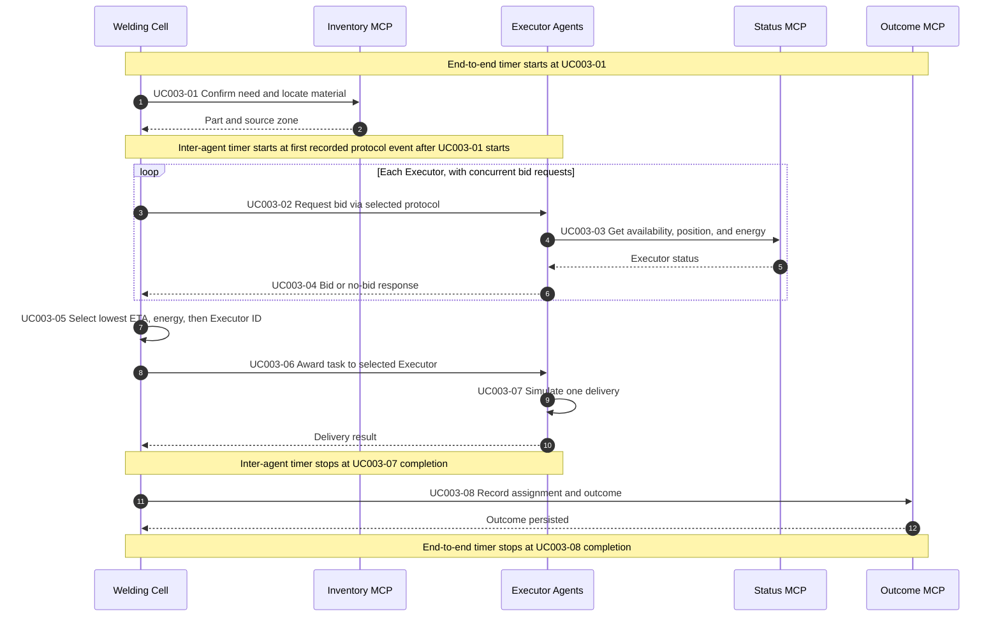
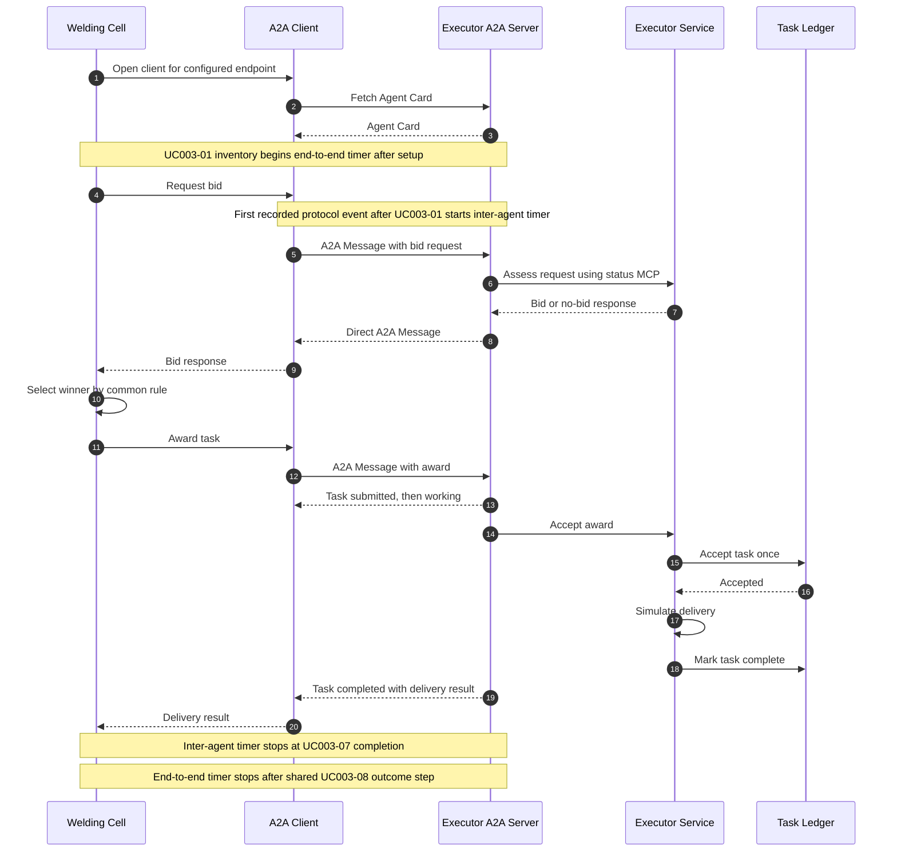
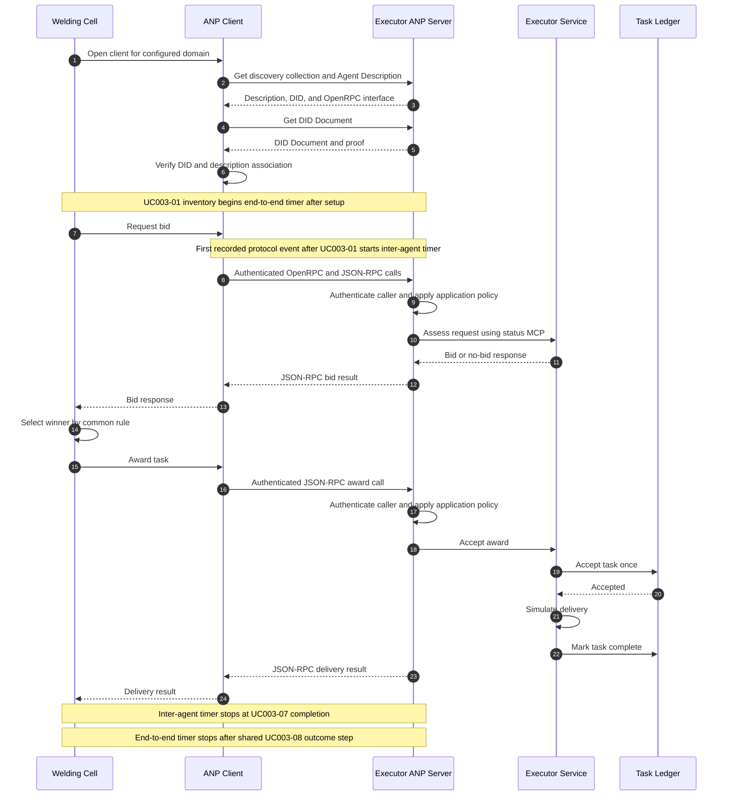
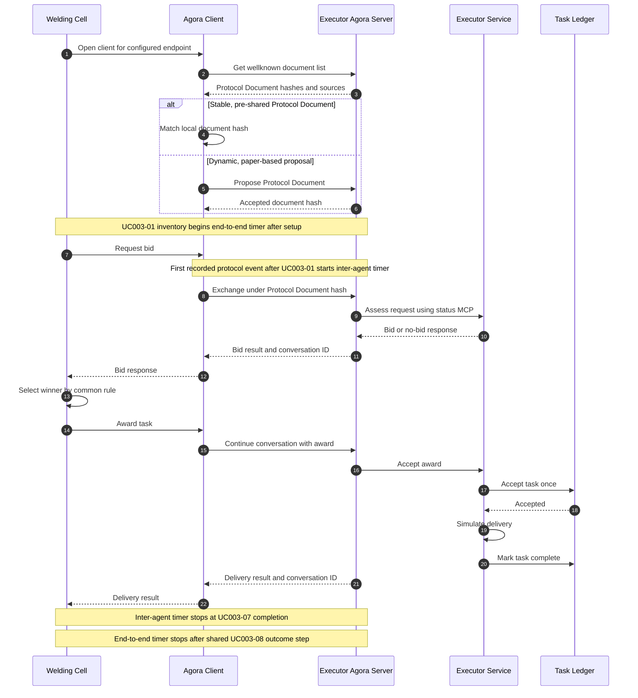

# Main Coordination Experiment: Intralogistics Transport Allocation

**Status:** Completed. This document reports only the 2026-09-25 matrix using Agent Protocols
Reference Kit v0.2.0. The fault experiment is documented separately in
[UC-003 fault experiment](fault-experiment.md).

## Goal

Evaluate how A2A, ANP, and Agora support the same industrial agent coordination task. This is an
empirical check for the paper's requirements-based protocol assessment: trace industrial needs to
observed behavior and identify what comes from the protocol, reference kit, or application. We
examine correct execution, coordination cost as the Executor fleet grows, first versus repeated
contact, and stable versus dynamically introduced participation. MCP is the common tool layer, not
a fourth inter-agent variant. The study describes these implementations under controlled local
conditions; it does not rank the protocols in general.

## Research questions and evidence

The research plan asks which UC-003 requirements each protocol supports, how coordination changes
with scale and reuse, how a participation change affects suitability, and whether implementation
evidence supports predictions drawn from protocol descriptions. This matrix addresses those
questions within the following measured boundary:

| Requirement | Evidence from this matrix | Boundary |
|---|---|---|
| Correct assignment and MCP tool use | Validated winner, one delivery, persisted outcome, and MCP calls | Shared application controls contribute to correctness. |
| Coordination cost and repeated contact | End-to-end and inter-agent latency by fleet size and round phase | Setup latency is outside the timed interval. |
| Dynamic participation | Correctness and timed coordination after one Executor is introduced | The address is supplied externally; onboarding time is unmeasured. |
| Communication work | Selected protocol events and serialized business payload bytes | Neither measure is a wire-message or total-network-byte count. |
| Auditability | Correlated event streams, manifests, outcomes, and validation files | The trace records this simulated workflow, not every network packet. |
| Identity and authorization | Setup traces and endpoint records | No spoofed counterpart is injected in this matrix; selected faults are assessed in the fault experiment. |
| Idempotent execution | One delivery and common task-ledger outcome in normal rounds | No duplicate award is injected in this matrix; replay is assessed in the fault experiment. |

These results can test limited implementation predictions, such as first-contact cost and scaling.
They cannot establish a universal protocol ranking or broad security conclusions.

## Workflow and controls

A Welding Cell Agent needs urgent material transport to its cell. Each Executor Agent represents a
simulated transport resource, such as an AGV or forklift. The Cell checks inventory through MCP,
requests a bid from each Executor through the selected inter-agent protocol, and collects responses.
Each Executor checks its status through MCP. The Cell selects the valid bid with the lowest arrival
time, then lowest energy cost, then lexicographically lowest Executor ID. It sends one award, the
winner performs one simulated delivery, and the Cell records the outcome through MCP.

The step IDs used in the evidence and timing definitions mean:

| Step | Action |
|---|---|
| `UC003-01` | Confirm the material need and locate the part through inventory MCP. |
| `UC003-02` | Request bids from all participating Executors. |
| `UC003-03` | Each Executor checks its availability and state through status MCP. |
| `UC003-04` | Executors submit bids or no-bid responses; the Cell collects them. |
| `UC003-05` | Select one winner by ETA, energy cost, then Executor ID. |
| `UC003-06` | Send the award to the winner. |
| `UC003-07` | Execute one simulated delivery and report its result. |
| `UC003-08` | Record the assignment and outcome through outcome MCP. |

All variants use the same request, ordered Executor fixtures, bid rule, deadline, simulated
delivery, MCP services, and application controls: schema validation, endpoint allowlisting,
deterministic selection, task-ledger idempotency, and correlated event recording. No LLM participates
in ordinary task execution.

The adapters exercise A2A Agent Card and task interactions, ANP discovery, DID verification and
typed calls, and Agora Protocol Document use or negotiation. Agora's negotiation path is a
paper-based reference-kit implementation. Protocol setup and application controls must be
attributed separately when interpreting the results.

### Protocol-focused sequences

These diagrams show one Executor on the normal delivery path. The shared inventory, status, winner
selection, and outcome steps appear in the general sequence above. Initial adapter setup precedes
the `UC003-01` end-to-end timer in the measured runs. The diagrams summarize the recorded v0.2.0 event traces and the protocol adapters in
[`src/agent_protocols_industrial_use_cases/adapters/`](../src/agent_protocols_industrial_use_cases/adapters/).

#### A2A

#### ANP

#### Agora

## Experimental design

| Factor | Recorded setting |
|---|---|
| Inter-agent protocol | A2A, ANP, Agora |
| Participation | Stable or dynamic |
| Total Executors | 1, 3, 5, or 10 |
| Per cell | One warm-up and ten measured runs |
| Per run | Five task rounds: first contact, then four repeated interactions |
| Executor response deadline | 5 seconds |
| Execution order | Balanced, seed `30001` |
| Environment | Fresh local processes and state per run; loopback host |

**Stable** means all `N` Executors are configured before the run under one simulated plant
authority. **Dynamic** means one of the `N` Executors is absent from the initial participant set
and is introduced during setup through an externally supplied endpoint. The application adds that
endpoint to its allowlist before bidding. This tests participation after introduction, not finding
an unknown network address or proving plant authorization. Initial introduction is outside the
measured coordination interval.

The 3 × 2 × 4 design yields 24 cells. Each run starts fresh processes and stores; rounds within a
run can reuse protocol state while application task state stays scoped to each task. This batch used
[`replication-20260925-config.json`](../inputs/main/config/replication-20260925-config.json) and its six
manifests. Their paths generated the recorded balanced schedule. The reference kit was pinned as an
external dependency and called through its public APIs. Evidence runs used real local inter-agent
HTTP(S) exchanges and stdio MCP calls, with deterministic fixtures and no LLM decisions.

## Evidence and validity

The public repository includes the curated measured-round data in
[`results/main/measurements.csv`](../results/main/measurements.csv) and its descriptive
aggregation in [`results/main/measurements-summary.csv`](../results/main/measurements-summary.csv).
Raw run manifests, event streams, outcomes, and validation bundles are not included in this public
release. The retained data were validated against the original run evidence before export.
The configuration files retain the frozen parameter values, with paths adjusted to this public
layout. Before a new run, update the source revision and lockfile digest in the input manifests to
identify the public checkout and its current `uv.lock`.

| Validation result | Count |
|---|---:|
| Scheduled runs completed | 264 / 264 |
| Validated rounds, including warm-ups | 1,320 / 1,320 |
| Measured rounds completed | 1,200 / 1,200 |
| Failed run attempts | 0 |
| Measured rounds with inter-agent duration exceeding end-to-end duration | 0 |

All measured rounds passed the recorded workflow and outcome checks, including the deterministic
winner and exactly one delivery. The 24 warm-up runs and their 120 rounds remain in the evidence but
are excluded from the descriptive tables below.

## Measurements

- **End-to-end latency:** `UC003-01` start to `UC003-08` completion, using monotonic timestamps.
- **Inter-agent latency:** the earliest recorded `protocol_native` or `paper_based` event at or after
  `UC003-01` start through `UC003-07` completion. The extractor excludes earlier protocol setup
  events.
- **Selected protocol events:** recorded `protocol_native` and `paper_based` events ending in
  `.sent`, `.received`, `.fetching`, `.fetched`, `.shared`, `.negotiated`, or `.proposed`. First-round
  counts include setup events before the coordination timer. ANP discovery calls are omitted by
  this filter; Agora's local `protocol_document.shared` event is included. The historical CSV field
  is named `logical_protocol_messages`, but these values are not network message counts.
- **Business payload bytes:** compact UTF-8 JSON of bid requests, bid responses, awards, and
  delivery responses, summed per round. This is not a capture of complete protocol or wire bytes;
  it excludes envelopes, headers, discovery and authentication exchanges, and transport framing.
- **MCP calls:** inventory, Executor-status, and outcome operations recorded per round.

The coordination timer begins after initial adapter setup. Agent Card retrieval, ANP discovery and
DID verification, and Agora document negotiation can occur before it. Some request-time
authentication can still occur during a round. Setup latency was not calculated separately.
The first round has ten independent run observations per cell; the repeated phase has four rounds
within each of those runs. These 40 repeated observations are nested, not independent runs.

## Results

### Coordination latency

Values are milliseconds. End-to-end entries are median (IQR); inter-agent entries are medians.
“First” is round 1 and “repeated” pools rounds 2–5. All slow observations remain included.

| Protocol | Condition | Fleet | First end-to-end | Repeated end-to-end | First inter-agent | Repeated inter-agent |
|---|---|---:|---:|---:|---:|---:|
| A2A | stable | 1 | 260.3 (24.6) | 224.4 (30.4) | 132.6 | 129.9 |
| A2A | stable | 3 | 418.9 (48.7) | 357.0 (30.6) | 285.0 | 265.3 |
| A2A | stable | 5 | 567.1 (30.6) | 481.8 (40.0) | 432.0 | 389.6 |
| A2A | stable | 10 | 904.3 (63.1) | 823.4 (59.0) | 763.9 | 731.9 |
| A2A | dynamic | 1 | 260.6 (37.8) | 217.1 (28.3) | 129.5 | 126.1 |
| A2A | dynamic | 3 | 417.2 (44.0) | 358.0 (38.2) | 283.6 | 264.2 |
| A2A | dynamic | 5 | 575.2 (59.0) | 484.4 (63.3) | 442.4 | 394.5 |
| A2A | dynamic | 10 | 883.2 (46.3) | 815.3 (50.1) | 752.3 | 726.2 |
| ANP | stable | 1 | 341.2 (18.2) | 233.9 (29.4) | 203.9 | 142.7 |
| ANP | stable | 3 | 625.6 (68.8) | 389.1 (29.8) | 492.6 | 298.2 |
| ANP | stable | 5 | 891.1 (22.1) | 551.2 (43.6) | 760.2 | 456.7 |
| ANP | stable | 10 | 1,521.2 (90.9) | 930.6 (73.7) | 1,385.5 | 841.2 |
| ANP | dynamic | 1 | 332.8 (14.7) | 241.7 (27.1) | 206.0 | 148.3 |
| ANP | dynamic | 3 | 627.8 (52.1) | 417.3 (55.4) | 480.9 | 321.0 |
| ANP | dynamic | 5 | 883.5 (64.3) | 569.7 (67.5) | 745.9 | 476.7 |
| ANP | dynamic | 10 | 1,533.4 (68.7) | 943.8 (99.0) | 1,390.1 | 850.3 |
| Agora | stable | 1 | 271.6 (47.5) | 218.1 (21.3) | 132.1 | 123.8 |
| Agora | stable | 3 | 409.8 (48.7) | 370.0 (27.6) | 278.9 | 272.9 |
| Agora | stable | 5 | 559.2 (27.3) | 489.1 (54.9) | 425.9 | 397.3 |
| Agora | stable | 10 | 924.2 (50.1) | 850.8 (59.9) | 780.6 | 759.9 |
| Agora | dynamic | 1 | 262.8 (17.0) | 221.0 (18.6) | 126.0 | 124.9 |
| Agora | dynamic | 3 | 418.2 (29.8) | 359.9 (42.2) | 283.7 | 265.9 |
| Agora | dynamic | 5 | 585.6 (85.6) | 511.1 (48.3) | 442.3 | 416.3 |
| Agora | dynamic | 10 | 910.0 (36.2) | 853.0 (84.6) | 766.3 | 759.1 |

### Selected events, business payload bytes, and MCP calls

Each entry is `first/repeated`. These are medians in each protocol, condition, and fleet-size cell.
The event counts reflect the filter above; the byte counts reflect business objects only.

| Protocol | Condition | Fleet | Selected events | Business payload bytes | MCP calls |
|---|---|---:|---:|---:|---:|
| A2A | stable | 1 | 6/4 | 648/664 | 3/3 |
| A2A | stable | 3 | 14/8 | 1,273/1,305 | 5/5 |
| A2A | stable | 5 | 22/12 | 1,911/1,959 | 7/7 |
| A2A | stable | 10 | 42/22 | 3,516/3,604 | 12/12 |
| A2A | dynamic | 1 | 6/4 | 652/668 | 3/3 |
| A2A | dynamic | 3 | 14/8 | 1,281/1,313 | 5/5 |
| A2A | dynamic | 5 | 22/12 | 1,923/1,971 | 7/7 |
| A2A | dynamic | 10 | 42/22 | 3,538/3,626 | 12/12 |
| ANP | stable | 1 | 4/4 | 648/664 | 3/3 |
| ANP | stable | 3 | 8/8 | 1,273/1,305 | 5/5 |
| ANP | stable | 5 | 12/12 | 1,911/1,959 | 7/7 |
| ANP | stable | 10 | 22/22 | 3,516/3,604 | 12/12 |
| ANP | dynamic | 1 | 4/4 | 652/668 | 3/3 |
| ANP | dynamic | 3 | 8/8 | 1,281/1,313 | 5/5 |
| ANP | dynamic | 5 | 12/12 | 1,923/1,971 | 7/7 |
| ANP | dynamic | 10 | 22/22 | 3,538/3,626 | 12/12 |
| Agora | stable | 1 | 7/4 | 656/672 | 3/3 |
| Agora | stable | 3 | 17/8 | 1,289/1,321 | 5/5 |
| Agora | stable | 5 | 27/12 | 1,935/1,983 | 7/7 |
| Agora | stable | 10 | 52/22 | 3,560/3,648 | 12/12 |
| Agora | dynamic | 1 | 8/4 | 660/676 | 3/3 |
| Agora | dynamic | 3 | 20/8 | 1,297/1,329 | 5/5 |
| Agora | dynamic | 5 | 32/12 | 1,947/1,995 | 7/7 |
| Agora | dynamic | 10 | 62/22 | 3,582/3,670 | 12/12 |

### Slow observations

Using an exploratory threshold of twice the median within each protocol, condition, fleet size,
and first/repeated phase, two measured rounds were slow: Agora dynamic, three Executors, run 3,
round 1 (1,614.0 ms), and Agora stable, three Executors, run 2, round 1 (1,674.7 ms). They were
valid outcomes and remain in the tables. Excluding them changes any affected stratum median by at
most 3.3 ms. The threshold and sensitivity check were formed after inspecting results; they are
descriptive, not an exclusion rule or a causal diagnosis.

## Interpretation

1. **Correct execution required common controls.** All 1,200 measured rounds completed with one
   deterministic winner and one delivery. The result establishes equivalent UC-003 outcomes under
   these application controls; it does not attribute the controls to each protocol.
2. **Coordination cost rose with fleet size.** End-to-end and inter-agent medians, selected events,
   business payload bytes, and MCP calls increased as Executors were added. All variants performed
   `N + 2` MCP calls per round for fleet size `N`; differing MCP call counts do not explain their
   latency differences.
3. **ANP had the highest first-round median in these implementations.** With ten Executors, ANP
   measured 1,521.2 ms stable and 1,533.4 ms dynamic, versus 883.2–924.2 ms for A2A and Agora.
   Its repeated medians fell to 930.6 and 943.8 ms. The measurement does not isolate a causal
   operation, and pre-round discovery and DID verification are outside the timer.
4. **A2A and Agora were close at this scale.** Their median ordering changed across cells, so this
   dataset supports no uniform speed ranking. All 24 cells had a lower repeated-round median than
   first-round median. Recorded first-contact events fell for A2A and Agora, but the latency
   difference cannot be assigned solely to protocol-state reuse.
5. **Dynamic participation showed no consistent timed penalty.** Dynamic and stable medians were
   close and changed ordering by cell. Because endpoint introduction and initial setup occurred
   before `UC003-01`, this result does not measure the cost of onboarding a new participant.
6. **Selected events expose different recorded setup paths.** A2A recorded `4N + 2` first-round
   events and `2N + 2` repeated events. ANP recorded `2N + 2` in both phases under this filter.
   Agora recorded `5N + 2` stable or `6N + 2` dynamic first-round events and `2N + 2` repeated
   events. These formulas describe instrumentation, not complete network traffic.

## Limits

- The work is simulated on one loopback host. It does not measure real robot motion, public-network
  behavior, production identity infrastructure, safety certification, or hard real-time behavior.
- The externally supplied endpoint and allowlist are application controls. This experiment does
  not establish protocol-native discovery of an unknown address or authorization of its operator.
- Setup/onboarding latency and complete wire traffic were not measured. The selected-event and
  payload-byte metrics cannot answer those questions.
- The results are descriptive. A protocol-wide ranking or statistical significance claim would
  require further analysis with runs as the independent units and repeated rounds nested within
  runs. The post-run slow-observation check is exploratory.
- Protocol capability and safety claims need separate mechanism evidence. The
  [fault experiment](fault-experiment.md) examines selected safety faults under
  the same reference-kit revision; these normal runs do not establish fault resistance.

## Provenance

The run manifests preserve the execution provenance, including the reference-kit revision,
use-case source fingerprint, and lockfile digest. Those identifiers refer to the private development
checkout used for the experiment; its GitLab history is not included in this public repository. The
configuration and lockfile hashes below are for the historical execution artifacts. The published
configuration uses public-layout paths, and the current `uv.lock` belongs to this fresh repository.
The exported measurements were validated against the original evidence from all 264 scheduled runs.

| Historical execution artifact | SHA-256 |
|---|---|
| Configuration | `8e9b9f795dff2142b7b14db31617b9be9f63fd37bf8bdfb05f408afbbd0c3760` |
| Run-time `uv.lock` | `23c139329f56cf338a3f0d508d85868c327a85baee0705e366efc8c137b9090e` |
| `schedule.json` | `b94e8a6b641d642a31d8550765ee1980ab0c156e62c171fa5cb32afec65cf82d` |
| `progress.json` | `95dca09b0fa3d5f5561a90a8ad38f3c94128ba84abe43aea852e81f0e5387899` |
| Published `results/main/measurements.csv` | `4059859bba7970f1f62dfbf27b753e0785c1a29bc3abf4e85bf69652dcde24f6` |
| Published `results/main/measurements-summary.csv` | `46ca87650f41a1b80695de7e13203144404ffd7f1a4cfb58bb4b9a03655dd014` |

## Summary

We implemented one Welding Cell–Executor coordination task with A2A, ANP, and Agora over the same
MCP services and application controls. The v0.2.0 matrix completed all 1,200 measured rounds
correctly. Latency and recorded work increased with fleet size; first rounds were slower than
repeated rounds in all 24 cells, especially for ANP. Stable and dynamic timed results were close,
while initial onboarding cost remains unmeasured. All three implementations executed this
controlled task successfully, with different recorded coordination costs. Endpoint
admission, idempotent delivery, validation, and outcome recording depend on application controls
that must be assessed separately from protocol behavior.
